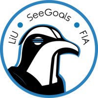

# See Goals Robot Controller

## Overview
### What is the purpose of this repo?
This is the repo containing the planing and exciton if a football game. All the strategies on how the robots will move and respond to opponents actions. This repo also is responsible for the connections with the SSL vision and the referee and sending the action to our robots.  

## Setup 🚀

Go to `https://github.com/LiU-SeeGoals/seegoals` and follow the setup in the README.md for running the code in docker containers.

After following the guide you should have a shell open in a container in the  `controller` repo (this repo) running locally. 

### running main script
To start the controller main program, go to 
```
cd cmd
```
And then run:
```
go run main.go
```

Now the main program have been started. 

### Logging

ATTENTION: If you cant view the logs because of permission issues, its because docker created them as root. You can fix this by running:
```
sudo chown -R $USER logs
```

This project uses the [zap logger](https://pkg.go.dev/go.uber.org/zap). The logger is configured in the `logging` package, which is also the package you need to import to log something. The logger is used throughout the project and should be used for all logging.

The logs are written to files in project_root/logs called readable.log and structured.log. The readable.log file is a human readable log file and the structured.log file is a structured log file. The structured log file is used for log analysis and can be used to create dashboards etc. The readable log file is used for debugging and should be used when you want to see the logs in a human readable format. The log files are automatically rotated when they reach a certain size.

you can view this file by running:
```
tail -f logs/readable.log
```

If you want to view a specific log level you can run:
```
tail -f log | grep INFO
```

if you want to view two or more log levels you can run:
```
tail -f log | grep -E 'INFO|ERROR'
```

Or if you want to view everything related to a specific robot you can run:
```
tail -f log | grep 'Robot 1'
```

To log something you can use the logger like this:
```go
package main

import (
    . "github.com/LiU-SeeGoals/controller/logging" // The dot is used avoid having to write logging.logger every time
)

func main() {
    Logger.Info("Hello world")
    Logger.Error("Hello world")
    Logger.Debug("Hello world")
    Logger.Warn("Hello world")
}
```


## Project Structure

Project structure is based on: https://github.com/golang-standards/project-layout
If you ever wonder where to put new files, please refer to it. 

This diagram describes how different part of the controller interacts with each other. It does not follow any specific diagram standard but is meant to give intuition on how the controller works. Each part in the diagram is described in more detail below.


### Receiver
The Receiver in the diagram represent the SSLReceiver struct which is responsible for receiving packets from the SSL vision and referee systems and subscribing to its multicast address. The Receiver is indifferent to whether it's the real ssl system or the simulation. 

The packets received are serialized with protobuf and contains information about robot positions, ball position, field geometry etc. for e detailed list see [INSERT LINK TO PROTOBUF WIKI]. This information is not guaranteed to be correct, robots or the ball can be missing, this should be handled by the GameInfo which is source of truth for the gamestate.


### GameInfo
The GameInfo is a struct that contains the source of truth for the gamestate, referee status and the field geometry. This is the only place where the gamestate is updated and should be the only place where the gamestate is read from. The gamestate is updated by the GameInfo when new packets are received from the Receiver. 

### AI
The AI consists of a slow decision pipeline (slowBrain) and a fast decision pipeline (fastBrain). The slowBrain is responsible for making high level decisions like which strategy to use and which roles robots should have. The fastBrain is responsible for making low level decisions like acting on the roles that have been assigned to the robots, referee decisions, collision avoidance etc. 


#### Communication
The AI communicates using channels. The AI component sends the gamestate to the slowBrain and fastBrain via channels. The fastBrain acts on the current gameplan and sends actions to the client. The slowBrain sends a new gameplan to the fastBrain when a new strategy is decided. One can think of the slowBrain as interrupting the fastBrain when a new strategy is needed, but the fastBrain is responsible for real-time decisions based on the current gameplan and gamestate.


### WebServer
Todo

### Client
This is where we send actions to the robots, the client is indifferent to whether it's the real robots or the simulation.

## Code standard
This project uses the [SeeGoals Go standard](https://github.com/LiU-SeeGoals/wiki/wiki/1.1.-Processes-&-Standards#seegoal---go-coding-standard).


## Compiling/Building

The project can be compiled by running `/scripts/build.sh`. This generates the executable in `/build` folder.

## Environment
Environment configuration cen be found in `.env`. This file is automatically loaded by the `config` package by the controller. It's strongly advised to use this file instead of hard coded solutions. Apart from the controller, the docker environment loads the `.env` file into its containers.

Following are the most important environment variables:

* `ENVIRONMENT` - environment flag to indicate what setup is being used
* `SSL_VISION_MULTICAST_ADDR` - multicast IP used by SSL vision
* `SSL_VISION_MAIN_PORT` - port used for tracking, detection, and geometry packets
* `SIM_ADDR` - sim IP address
* `SIM_COMMAND_LISTEN_PORT` - sim command listen port
* `GC_PUBLISH_ADDR` - multicast IP used by game controller
* `GC_PUBLISH_PORT` - publish port used by game controller
* `WEB_VISION_UI_PORT` - port on host machine for SSL vision UI when running docker
* `WEB_GC_UI_PORT` - port on host machine for game controller UI when running docker

<!-- ## Docker environment
The docker environment should be used for local development. It uses sim to simulate the game.

To start the environment:
```sh
./scripts/compose_up.sh
```

This will start the docker environment (in detached mode). The Seegoals controller is meant to be run from inside the container. The controller container can be entered by:
```sh
./scripts/enter.sh
```

Taking down the environment is done with
```sh
./scripts/compose_down.sh
``` -->
