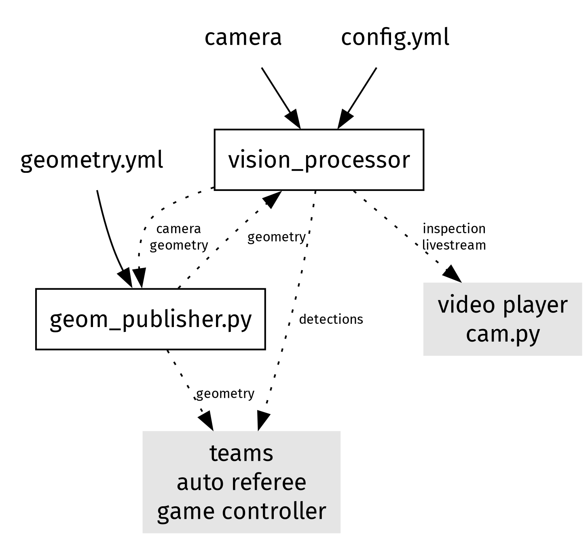
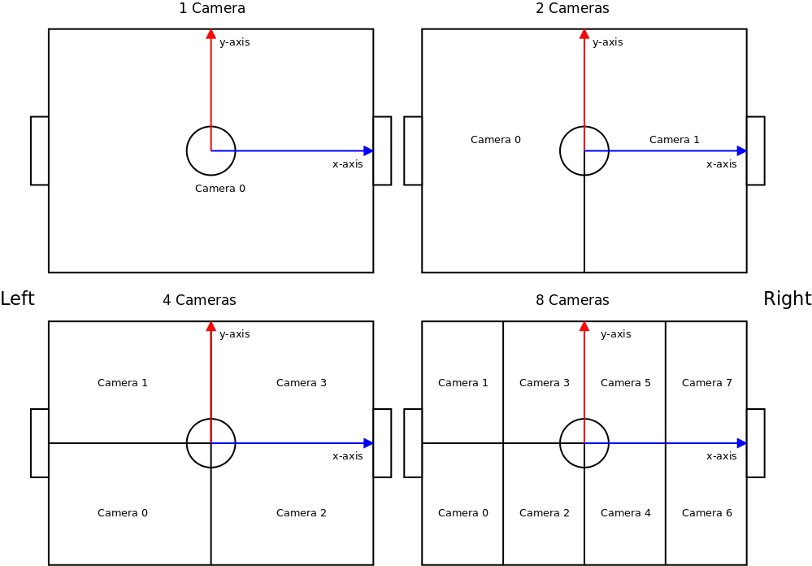
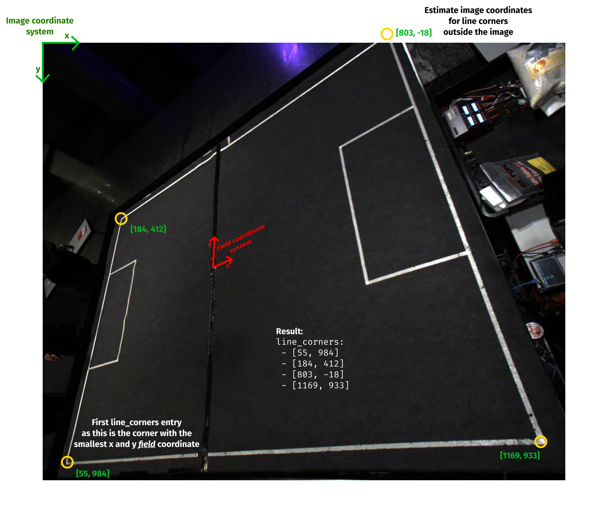

# Vision Processor
A replacement for the aging (ssl-vision)[https://github.com/RoboCup-SSL/ssl-vision].
The shape based blob detector and decentralized software architecture is intended to
minimize setup time and improve detection rates in uneven illumination conditions.
It currently supports Teledyne FLIR (Spinnaker), Matrix Vision (Bluefox3/mvIMPACT) and OpenCV camera backends.

The `vision_processor` is the image processing component that processes a camera feed
to multicast the detected robot and ball positions and a debug video livestream.
The geometry publisher `geom_publisher.py` publishes the field geometry
for all vision_processors, teams and the game controller.
`cam_viewer.py` opens the `mpv` video player with the camera streams from the vision_processor instances.

## SeeGoals lab startup

After the one-time `./setup.sh` build (answer **n** to installing its generic
systemd services), run `sg-start --vision-processor` or select option **8** in
`sg-start`. This launches the SeeGoals geometry publisher, all three camera
processors, and the lab Docker stack with AutoRef. Stop everything with
`sg-kill`. See the [startup guide](../../scripts/README.md) for prerequisites,
local camera overrides, logs, and camera previews.

## Wrapper

A modular replacement for `geom_publisher.py` plus a browser UI:

- `wrapper_backend/` — async Python (uv-managed). Owns the field geometry, absorbs incoming calibrations, exposes the bus over WebSocket. Run with `./start_wrapper.sh` (defaults to `geometry-divB.yml`). See [`wrapper_backend/README.md`](wrapper_backend/README.md).
- `wrapper-frontend/` — Svelte 5 + TypeScript + Vite. Connects to the backend's WebSocket and renders the operator UI. Run with `cd wrapper-frontend && npm install && npm run dev`. See [`wrapper-frontend/README.md`](wrapper-frontend/README.md).

## Dependency installation and compilation

### Only geom_publisher.py cam_viewer.py (e.g. vision expert laptop)
Required only for the geometry publisher and camera viewer.
`mpv` is optional and only required for the camera viewer.

Debian/Ubuntu based distributions: `apt install protobuf-compiler python3-protobuf python3-yaml mpv`

Arch based distributions: `pacman -S make python-protobuf python-yaml mpv`

Installation with PIP: `pip install protobuf pyyaml`

### vision_processor automatic (recommended)

1. Install the camera SDK required for your camera type
   (Arch user repository mvIMPACT: `mvimpact-acquire` Spinnaker: `spinnaker-sdk`)
2. Debian/Ubuntu/Arch Linux/Manjaro: Run `./setup.sh`.
   If the script wants to install an OpenCL driver for the wrong GPU (e.g. integrated graphics card)
   or you want, need or have a different OpenCL driver skip the driver installation with `SKIP_DRIVERS=1 ./setup.sh`.

### vision_processor manual

1. Install the camera SDK required for your camera type
   (Arch user repository mvIMPACT: `mvimpact-acquire` Spinnaker: `spinnaker-sdk`)
2. Install the required dependencies:

   - cmake
   - Eigen3
   - ffmpeg
   - gcc
   - OpenCL (GPU based runtime recommended)
   - OpenCV
   - protobuf
   - yaml-cpp

3. Compile vision_processor:

    cmake -B build .
    make -C build vision_processor

## Setup

1. Complete the dependency installation and compilation section.
2. Configure one `config-minimal.yml` or `config.yml` for each camera, skip the `geometry` section for now.
   The camera ids are assigned like in ssl-vision:
   
3. Start `build/vision_processor config[X].yml` for each camera.
4. Tune the orientation and position of each camera.
   You can view the camera feeds with `python/cam_viewer.py --cameras <X>`.
5. Restart the `vision_processor`s for the generation of a new sample image `img/[X].raw.jpg`
   and complete the `geometry` section of each camera config with it.
   Visual explanation how to determine `line_corners`: 
6. Restart all `vision_processor`s to pick up the new `geometry` section.
   Subsequent edits to thresholds, tracking limits and color references in `config[X].yml`
   are picked up live (within ~0.5 s) without a restart; camera, geometry, network and stream
   sections still require a restart.
7. Modify `geometry[X].yml` to match your field geometry.
   (for simple use cases configuring the field size, penalty area and goal will suffice)
8. Start `python/geom_publisher.py geometry[X].yml`.
   The calibration is successful when the reprojected livestream views are parallel to the image frame.
   If the calibration is unsuccessful, restart the geom_publisher for a new geometry calibration.
   For setups with multiple cameras it is recommended to tune the calibration by hand.

## Troubleshooting

Further information regarding setup and troubleshooting can be found in [documentation.md](documentation.md).

The camera livestream cycles through 4 different views:
1. **Raw camera data**
   If the data is very bright, dark or miscolored consider adjusting
   the camera `gain`, `exposure` and `white_balance` in your `config[X].yml`.
2. **Reprojected color delta**
   If the visible reprojected image extent does not match the field boundary the geometry calibration has issues.
   If color blobs are desaturated in the center your image might be overexposed/too bright (`gain`, `exposure`).
3. **Gradient dot product**
   All color blobs should be visible here as black and white checkered rings.
4. **Blob circularity score**
   If the blob score of some undetected blobs is too faint consider reducing the `circularity` threshold.

### No OpenCL platform/device found

If no OpenCL platform can be found despite OpenCL driver installation, check the users groups and permission to compute
on the GPU (e.g. for Intel: ).

### Bots frequently changing team and IDs

If the blobs are nearly white: adjust exposure, gain and gamma such that the blobs are no longer oversaturated.

### Ghost balls at field line crossings

- Adjust the white balance such that field lines have no orange tint.
- Carefully try increasing the `score` threshold.

### Balls undetected or blobs are attributed the wrong color

If blobs are attributed the wrong color (or balls are seemingly undetected despite high blob scores)
adjust the reference colors under `color`.

### Bot detections are lost in close distance

If bot detections are lost when multiple bots are in close distance (e.g. during collisions), increase `clipping_tolerance`.

### Partial robots at an overlapping camera's image edge disturb tracking

Set `thresholds.min_bot_cam_edge_distance` for the affected camera to reject
robot candidates near image edges that lie inside the field. The distance is
in field millimetres; `0` disables this filter. SeeGoals camera 2 starts with
`170.0`, leaving those overlap regions to cameras 0/1. This value reloads live.
If using `config-camera-2.local.yml`, add the setting to that file too.

This margin does not fix exposure, focus, color classification, or calibration
errors in the camera's central view. For those, inspect `img/2.raw.jpg`,
`img/2.flat.jpg`, and `img/2.blob.jpg` with a robot in the affected region.

### Calibration is wrong on a field missing some standard lines

If your physical field is missing one of the optional SSL markings (center-to-center line, halfway line, center circle, or penalty-area stretches), the calibration is fed lines that the camera cannot see and the reprojection does not match the field boundary.
In `geometry[X].yml` set the corresponding flag under `optional_field_lines` to `false`:

    optional_field_lines:
      goal2goal: false     # set to false if your field has no end-to-end center line
      halfway: true
      centercircle: true
      penalty: true

### Bottom half of frames looks smeared / blurred (H.264 network source)

H.264 RTSP streams can silently produce corrupted frames on slower or throttled machines. Switch the source to MJPEG, or run on a machine with a real OpenCL GPU.

### Tune an Axis camera for robot tracking

The Axis autotuner changes the camera's VAPIX exposure limits, listens to the
raw SSL detections for that camera, and keeps the setting with the best robot
detection coverage and confidence. Run it while the robots move through the
camera's whole field of view. The default camera file is camera 2; use the
local file so credentials are not added to a command line:

    python3 python/axis_autotune.py --config config-camera-2.local.yml --probe

Then run a trial. Supplying expected robot IDs makes the score measure recall
for those robots instead of only measuring whether any robot was detected:

    python3 python/axis_autotune.py --config config-camera-2.local.yml \
      --expected-robots y0,y1,b0,b1 --duration 10 --settle 2

The tuner tests `MaxExposureTime` and `MaxGain` values when the camera exposes
them; on older Axis firmware it falls back to `ExposurePriority`. It applies
the best combination and writes `axis-autotune-result.json`. Use `--no-apply` to
restore the original camera settings after the trials, or `--dry-run` to print
the candidate grid without changing the camera. Pressing Ctrl+C restores the
original settings as well. The account must have operator or administrator
rights for the Axis parameter API.

### Camera preview disappears after changing settings / backwards time jump warnings

Camera setting changes can interrupt the input stream. Check the camera's own
live view first. Once it is working, stop vision with `sg-kill`, start
`python3 python/cam_viewer.py --cameras 3`, then restart with
`sg-start --vision-processor`. Starting the viewer first lets it receive the
debug stream's initial H.264 parameters. If the camera's own live view is also
missing, restore the changed camera setting before restarting vision.

`Large backwards time jump suppressed` is an inter-camera clock adjustment
warning, not a UDP bind or receive error. The synchronizer retains peer timing
offsets when a camera stops sending. The SeeGoals launcher passes
`--shared-clock` to all three processors because they run on the same PC;
this disables those adjustments and uses the shared host clock. Rebuild the
processor after updating the launcher. For manual same-PC launches, use e.g.
`./build/vision_processor --shared-clock config-camera-2.yml` for each camera.
Network OpenCV inputs always use host timestamps rather than decoder frame
positions. Separate-host deployments keep the existing synchronization behavior
unless `--shared-clock` is explicitly supplied.
For live OpenCV inputs, `t_capture` is now stamped when `VideoCapture.read()`
returns the decoded frame. The difference between `t_sent` and `t_capture`
therefore includes processor waiting, transfer, and detection time. It cannot
measure time spent inside the camera, network, or decoder before `read()` returns.

### Live camera lag when processing falls behind

Live OpenCV inputs (network streams and `/dev/` cameras) are read continuously
by a capture thread. It keeps only the newest pending frame and replaces any
older unprocessed frame. Detection takes that frame when ready and waits for a
new one if it has already consumed it. Recorded video files still process every
frame in order.

This prevents slow detection or debug output from building up a queue of old
frames in the processor. It does not remove latency already inside the camera,
network, decoder, or preview player. `frame time overrun` can still appear when
detection exceeds the camera's frame interval; intermediate frames are skipped
instead of being processed later. No YAML setting is needed; rebuild the
processor and restart `sg-start --vision-processor` to use this behavior.

Network inputs request a three-second read timeout when opening the stream,
using the [OpenCV FFmpeg/GStreamer timeout option](https://docs.opencv.org/4.x/d4/d15/group__videoio__flags__base.html).
A failed or timed-out read ends capture and wakes the processing thread so the
launcher can stop the other vision processes instead of waiting indefinitely
for another frame.

### If nothing else helps

Activate `stream: raw_feed: true` in your `config[X].yml` and record the video livestream
with `ffmpeg -protocol_whitelist file,rtp,udp -i python/cam[X].sdp cam[X].mp4`.
Publish the resulting video including your `config[X].yml` and `geometry[X].yml` for further remote analysis in a bug report.
